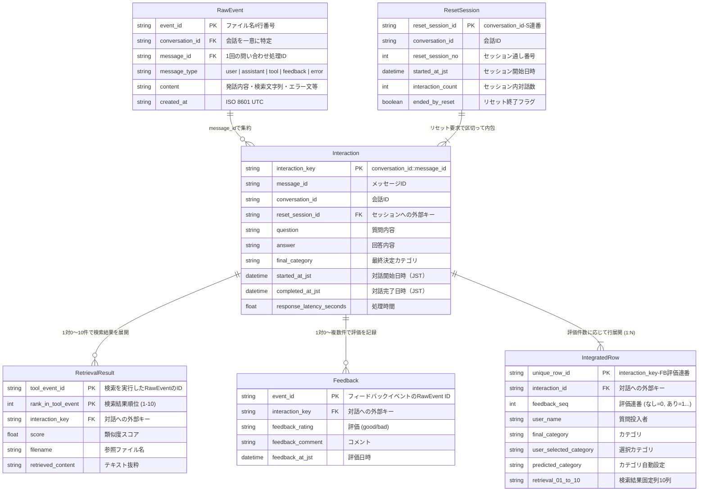

# YourNavi-QAIログ正規化・リセットセッション化 設計仕様書

本仕様書は、Q&Aボット（YourNavi-QAI）の生イベントログを読み込み、対話（Interaction）単位への集約、セッション化（Reset Session）、類似文書検索結果の展開、評価データの結合、および分析用集計を行う処理システムのデータフロー、データモデリング、およびカラム定義について解説します。

---

## 1. システム概要と全体構造

本システムは、対話ログを「分析に適したデータ構造」へ加工・集約し、最終的な分析用「実施記録シート」を含むエクセルワークブック、および各種CSVファイルを出力します。

処理の全体構造は以下の通りです。

```
[Raw Event Rows (CSV原本)]
          │
          ▼ 1. message_id + conversation_id で集約・整理
[Interactions (対話テーブル)] ──(1:N)──► [Retrieval Results (検索結果展開)]
          │                                  (similar_recordsを展開)
          ▼ 2. ユーザーの「リセット」要求を境界としてセッション分割
[Reset Sessions (セッションテーブル)]
          │
          ▼ 3. 対話・検索・評価・セッションを突合して平坦化
          │    (1つの対話に複数評価がある場合は評価数分行を複製)
[Integrated Rows (統合データ)]
          │
          ├──────────────────────────┐
          ▼                          ▼
[integrated.csv (統合CSV)]    [実施記録分析シート_統合版_*.xlsx]
                              (日本語ヘッダー・順序を設定ファイルで管理)
```

---

## 2. データフロー (Data Flow)

入力CSVの読み込みから最終ファイル出力までのプロセスを記載します。

```mermaid
graph TD
    A[入力ディレクトリ] -->|*.csvのファイル名順探索| B(reader: ファイル読込)
    B -->|BOM付UTF-8 / CP932 / UTF-8自動判定| C{IRM保護ファイル?}
    C -->|Yes| D[スキップ判定・警告出力]
    C -->|No| E[dict_readerで各行をRawEventとして読込]
    
    E --> F(normalizer: Interaction集約)
    F -->|conversation_id + message_id でグループ化| G[Interaction単位にイベントを集約]
    G -->|開始・終了時刻/処理秒数/各フラグ算出| H[Interactionsの生成]
    G -->|similar_recordsのJSON/Literalパース| I[Retrieval Resultsの生成]
    
    H --> J(sessionizer: セッション化)
    J -->|同一conversation_id内を時系列に整理| K{message_type == user かつ content == リセット?}
    K -->|Yes| L[その対話を現セッションの終端とし新規セッション番号発番]
    K -->|No| M[既存セッションへ対話を所属]
    
    M --> N(integrated: 統合行構築)
    N -->|InteractionとResetSessionをマージ| O{対話に対するFeedback件数?}
    O -->|0件| P[1行出力: 評価関連列は空欄]
    O -->|1件| Q[1行出力: 対話情報 + 評価情報を結合]
    O -->|2件以上| R[複数行出力: 2行目以降は対話・検索詳細を空にし、質問内容を[追加評価]として評価ごとに行展開]
    
    P & Q & R --> S(writer & excel_writer: 出力)
    S --> T[integrated.csv 出力]
    S -->|column_config.json の定義順・表示名に動的マッピング| U[統合版エクセル 実施記録シート 生成]
```

---

## 3. データモデリング & リレーション (Entity Relationship)

各データ階層の論理定義と、それらのリレーションシップは以下のERモデリングで定義されます。



---

## 4. カラムマッピング & 変数変換マトリクス

### 4.1 基本カラムマッピング

元のログCSV（生ログ）から入力される各カラムが、統合データ（`IntegratedRow` / エクセル）へどのようにマッピング・加工されているかを定義します。

| 元CSVのカラム名 | 統合版エクセルの列キー (`physical_name`) | is_system_defined | 変換ルール・ロジック |
| :--- | :--- | :---: | :--- |
| `user_name` | `user_name` | `false` | そのまま出力。ただし、CLI引数 `--anonymize-users` 指定時はハッシュ匿名化。 |
| `team_name` | `team_name` | `false` | そのまま出力（エクセルでは「チーム名」と表記）。 |
| `conversation_id`| `conversation_id` | `false` | そのまま出力。 |
| `message_id` | `message_id` | `false` | そのまま出力。 |
| `created_at` | `started_at_jst` / `completed_at_jst` | `true` | グループ化されたInteractionに属する全イベントの `created_at` の最小値を開始日時、最大値（Feedback除外）を完了日時とし、JST (UTC+9) に変換した上で `YYYY-MM-DDTHH:MM:SS+09:00` 形式で格納。 |
| | `latency_sec` | `true` | `(completed_at_jst - started_at_jst)` の総秒数（小数点第3位まで）を計算。 |
| `content` | `質問内容` | `true` | `message_type == 'user'` のイベントの `content` 本文（非自然言語指示もそのまま保持）。複数フィードバック時の2行目以降は `[追加評価]` を格納。 |
| | `user_content_raw` | `true` | ユーザーが入力したそのままの生テキスト。 |
| | `回答内容` | `true` | `message_type == 'assistant'` のイベントの `content` 本文。 |
| `category` | `user_selected_category` | `true` | ユーザーが選択したカテゴリをパイプ区切りで連結。 |
| | `predicted_category` | `true` | システムが推論したカテゴリ（`predicted`）を格納。 |
| | `fist_category` | `true` | `predicted_category` を ` > ` で分割した第1階層を抽出。 |
| | `final_category` | `true` | **優先順位ルール適用**: 1. `user_selected_category` (最終選択値) があれば採用。2. なければ `predicted_category` を採用。3. いずれもなければ「未分類」とする。 |
| `feedback_rating`| `feedback_rating` | `false` | ユーザーの回答評価値（`good` / `bad`。これら以外（空文字含む）の場合は「未設定」と表記、エクセルでは「回答評価」と表記）。 |
| `feedback_comment`| `feedback_comment` | `false` | ユーザーのコメント本文（エクセルでは「評価理由」と表記）。 |
| `similar_records` | `retrieval_01` 〜 `retrieval_10` | `true` | リスト内の検索ヒット情報を解析し、上位10件分を固定 of JSONテキストカラム（`rank`/`score`/`filename`/`content`/`metadata` を内包）として横持ち展開。 |

### 4.2 システム算出・定義カラム (`is_system_defined: true`) の詳細定義

プログラムの内部処理によって自動的に生成・算出されるシステム定義カラムについて、その算出ロジックと目的・用途を定義します。

| 統合版エクセルの列キー (`physical_name`) | 生成・算出ロジック | 目的・用途 |
| :--- | :--- | :--- |
| `unique_row_id` | `interaction_id` と `feedback_seq` を `-FB{seq:03d}` で結合して生成。 | 複数フィードバック（評価）による複製行を含めた、全出力データの完全な一意キー（プライマリキー）を確保するため。 |
| `No.` | エクセル上の行番号に基づいて動的に数式 `=ROW(A{row_num})-3` を挿入。 | 分析時の連番（1から開始）の自動表示。 |
| `interaction_id` | `conversation_id` と `message_id` を `-` で結合。同じメッセージIDが同一会話セッション内で時系列順に重複して発生した場合は、クロノロジカルに連番サフィックス（`-02` 等）を付与。 | 同一会話セッション内での1往復（質問＋回答＋検索＋評価）を一つの対話グループとして特定・集約するため。 |
| `reset_session_id` | `conversation_id` とセッション連番を組み合わせた一意ID。 | 会話内でユーザーが「リセット」要求を行って区切られた「セッション」をグルーピング・特定するため。 |
| `reset_session_no` | 同一会話セッション（`conversation_id`）内で、何番目のセッションであるかのシーケンス番号（1から開始）。 | セッション全体の推移のトレースと分析。 |
| `interaction_no_in_session` | 同一セッション（`reset_session_id`）内で、何番目の対話（QA）であるかの連番（1から開始）。 | セッション開始から何回目のやり取りで課題が解決したか（または離脱したか）の分析。 |
| `is_first_interaction_row` | その対話に属する出力行の中で、最初の評価連番（`feedback_seq == 1`、評価無しの場合は `feedback_seq == 0`）の行を `1`、それ以外の複製行（追加のフィードバック行）を `0` とする。 | 重複した対話内容をカウントせず、純粋な対話回数や応答速度の平均をユニークに集計できるようにするため。 |
| `質問内容` | メッセージタイプが `user` のイベントの `content` 本文。非自然言語指示も保持し、2行目以降は `[追加評価]` とする。 | 分析時にユーザーが何を入力したかを確認するため。 |
| `user_content_raw` | ユーザーイベントの `content` を無加工でそのまま保持。2行目以降は空欄。 | 監査時の生データ確認用。 |
| `is_natural_language_query` | ユーザーの入力内容が、リセットや短縮コマンド（「こんにちは」など）のいずれにも該当しない場合に `1`、それ以外に `0` を設定（エクセル上では「集計対象」と表記）。 | 分析対象となる「実質的な質問」のみをフィルタリングするため。 |
| `is_reset_request` | ユーザーの入力テキストが `リセット` の場合に `1`、それ以外に `0`。 | セッション切替イベントの特定。 |
| `is_system_command` | ユーザーの入力テキストが登録コマンドリスト（`ヘルプ`、`こんにちは` など）に合致する場合に `1`、それ以外に `0`。 | システムコマンド操作の特定。 |
| `started_at_jst` / `completed_at_jst` | 対話グループ内の全イベントの最小 `created_at`（開始）および最大 `created_at` (Feedbackを除く、完了) をJST（UTC+9）タイムゾーン表記（`YYYY-MM-DDTHH:MM:SS+09:00`）に変換。 | 日本時間基準でのデータ集計（日次集計や時間帯別分析など）。 |
| `latency_sec` | `(completed_at_jst - started_at_jst)` の総秒数を小数点第3位まで算出。 | レスポンス速度の監視と性能目標評価。 |
| `note` | 手動分析用の空欄備考列（エクセル上では「備考」と表記）。 | アナリストによる手動コメント記録用。 |
| `selected_function` | アシスタントメッセージから `[選択された関数][...]` の文字列パターンを抽出・重複排除して ` | ` で結合。 | どの機能/ツールが動作したかの技術的な追跡。 |
| `predicted_category` | アシスタントメッセージから `[カテゴリ選択]` で指定されたカテゴリ名を抽出。 | AIが判定した予測カテゴリの記録。 |
| `user_selected_category` | ユーザーメッセージから `[カテゴリ選択]` で指定されたカテゴリ名を抽出・重複排除して ` | ` で結合。 | ユーザーが自身で選択したカテゴリの記録。 |
| `fist_category` | `predicted_category` を ` > ` で分割した最初の文字列。 | 大カテゴリレベルでの階層集計用。 |
| `final_category` | 1. ユーザー選択カテゴリ（最終選択値）、2. 予測カテゴリ、3. いずれも無い場合は「未分類」の優先順位で決定。 | 最終的にどのカテゴリに割り当てられたかを一元管理する。 |
| `category_source` | 最終カテゴリの決定元（`user_selected`, `predicted`, `none`）を格納。 | カテゴリ分類がAI予測なのかユーザー選択なのかを分析するため。 |
| `is_unclassified` | `final_category` が「未分類」の場合は `1`、分類済みの場合は `0`。 | 未分類の対話のみを素早くフィルタリングし、辞書や予測モデルの改善に役立てるため。 |
| `回答内容` | アシスタントメッセージの `content` 本文（システムログを除く）。2行目以降は空欄。 | システムが返した回答テキストの確認。 |
| `has_answer` | `回答内容` が存在すれば `1`、空欄なら `0`。 | 回答率（無回答やエラーの裏返し）の算出。 |
| `is_no_answer` | 回答内容に「ご質問の内容に関する情報が見つかりませんでした」が含まれる場合に `1`、それ以外に `0`。 | ナレッジ不足による「回答なし（回答不能）」の件数測定とコンテンツ改善用。 |
| `assistant_event_count` | 1対話内に含まれる `assistant` のイベント数。 | 対話の構造監査用。 |
| `has_error` | 対話内に `error` タイプのイベントが1つでも含まれる場合に `1`、それ以外に `0`。 | システムエラー発生率の測定。 |
| `error_count` | 対話内に含まれる `error` タイプのイベントの総数。 | エラー頻度測定。 |
| `error_message` | 発生した `error` イベントのテキスト本文を改行区切りで結合。 | エラー原因の調査・デバッグ。 |
| `retrieval_count` | 対話の `tool` イベントからパースした `similar_records` リストの総件数。 | 検索エンジンでヒットした候補件数の測定。 |
| `retrieval_stored_count` | この行に格納されている検索結果の件数（最大10件）。 | 行に埋め込まれた検索結果数の記録。 |
| `retrieval_truncated` | `retrieval_count > 10` の場合に `1` , それ以外に `0`。 | 検索ヒット数が表示上限を超えて切り捨てられたかのフラグ。 |
| `retrieval_01` 〜 `retrieval_10` | `similar_records` 内のJSONから上位10件分を展開。各カラムには順位、スコア、ファイル名、カテゴリ、コンテンツ等を内包したJSONを格納。 | エクセル上で「参照文書①」〜「参考箇所⑩」にセル値として展開するための元データ。 |
| `feedback_id` | `interaction_id` と `feedback_seq` を結合した一意ID。 | 各フィードバックイベントを特定する。 |
| `feedback_seq` | 評価イベントの発生順連番。評価なしの場合は `0`。 | 同一対話に対する複数評価の順序特定。 |
| `feedback_count` | この対話に紐づくフィードバックイベントの総件数。 | 同一対話に対する評価の活性度。 |
| `feedback_at_utc` / `feedback_at_jst` | 評価イベントの発生日時。 | 評価が投稿された日時のトレース。 |
| `is_latest_feedback` | 最も新しい評価イベントの行を `1`、過去の評価行を `0` とする。 | 最終的な良悪評価を集計する際に、同一ユーザーによる上書き評価のみをユニークにカウントするため。 |
| `session_ends_with_reset` | セッションの最後の対話がリセット要求で終わった場合に `1`、それ以外（時間切れ等）に `0`。 | ユーザーが意図的に対話を切断したセッション of 割合の測定。 |
| `source_files` | 対話に含まれるイベントの元となった生CSVファイル名のリスト。 | データソースへのトレーサビリティ確保。 |
| `source_event_row_count` | 対話に含まれる全イベントの総件数。 | データ整合性の監査用。 |
| `source_event_types` | 対話に含まれるイベントの `message_type` の時系列遷移（例：`user > assistant > tool > feedback`）。 | 処理フローの監査用。 |
| `normalization_version` | 処理ツールのバージョン情報。 | データの処理履歴・品質監査用。 |
| `normalization_warnings` | 整合性エラー（ID重複やパース失敗など）があればその警告内容をパイプ区切りで格納。 | 不整合データの検知とトラブルシューティング。 |

### 4.3 算出ロジックの実装コード対応定義

プログラム内でシステム定義カラム（`is_system_defined: true`）の算出・生成ロジックがどのソースコードファイルおよび関数に実装されているかを定義します。

| 処理フェーズ・コンポーネント | 実装ソースファイル（リンク） | 担当する関数/クラス | 主な生成・算出変数/カラム |
| :--- | :--- | :--- | :--- |
| **対話（Interaction）の分割と基本属性の算出** | [normalizer.py](../normalizer.py) | `assign_unique_interaction_keys` | `interaction_id` (会話IDとメッセージIDを結合し重複時に連番サフィックスを付与して生成) |
| | | `normalize_events` | `started_at_jst`, `completed_at_jst`, `latency_sec` (処理秒数の計算)<br>`質問内容`, `user_content_raw` (発話文の抽出)<br>`is_natural_language_query`, `is_reset_request`, `is_system_command` (ユーザー発話判定フラグ)<br>`selected_function`, `predicted_category`, `user_selected_category`, `fist_category` (予測・選択カテゴリ抽出)<br>`回答内容`, `has_answer`, `is_no_answer` (回答抽出と回答有無・回答なしフラグ)<br>`has_error`, `error_count`, `error_message` (エラー監査情報) |
| **セッション分割（Sessionization）** | [sessionizer.py](../sessionizer.py) | `sessionize` | `reset_session_id` (リセット境界ごとの一意セッションID)<br>`reset_session_no` (リセットが実行された順番のセッション番号)<br>`interaction_no_in_session` (セッション内の対話連番) |
| **データマージ・複製行処理（Integration）** | [integrated.py](../integrated.py) | `build_integrated_rows` | `unique_row_id` (対話IDと評価連番の結合ID)<br>`is_first_interaction_row` (初回対話行フラグ)<br>`is_latest_feedback` (最新評価フラグ)<br>`retrieval_01` 〜 `retrieval_10` (検索ヒット結果10件のJSON展開)<br>**2行目以降の複製行処理**: `質問内容` を `[追加評価]` に書き換え、その他の対話情報・メトリクス・検索結果をクリアする制御ロジック |
| **エクセル数式セルの動的解決と書き込み** | [excel_writer.py](../excel_writer.py) | `write_integrated_to_excel` | `No.` (動的連番数式)<br>`対象/対象外` (分類に基づく対象フラグ数式)<br>各 `参照箇所①〜⑩` のキーワード部分一致判定（キーワードを含まない場合は空文字 `""`）および `Hit判定` の自動判定数式<br>L列からAO列の文字左詰めアライメント適用 |

### 4.4 `normalize_events` 内部の段階的処理ロジックの詳細

[normalizer.py](../normalizer.py) の `normalize_events` 関数内で実行される具体的なデータ処理アルゴリズムは、以下の5つのフェーズで構成されています。

```mermaid
graph TD
    Phase1[フェーズ1: 全イベントの時系列ソートとID付与] --> Phase2[フェーズ2: 対話キー (interaction_key) の動的割当]
    Phase2 --> Phase3[フェーズ3: 対話単位でのイベント集約と属性抽出]
    Phase3 --> Phase4[フェーズ4: フラグおよび数値メトリクスの計算]
    Phase4 --> Phase5[フェーズ5: 整合性検証とエラー検知]
```

#### フェーズ1: 全イベントの時系列ソートとID付与
1. 読み込まれた全生ログイベント（`RawEvent`）をグローバルで並び替えます。ソートキーは優先度順に以下の通りです。
   - 1. イベントの発生日時 (`created_at_utc`、値が無いものは末尾に配置しつつ相対順序を維持)
   - 2. 入力ファイル名 (`source_file`)
   - 3. ファイル内の行番号 (`source_row_number`)
2. ソートされた順に、全イベントに対してグローバル連番 `global_event_no` を1から順に割り当てます。

#### フェーズ2: 対話キー (`interaction_key`) の動的割当と対話境界の決定
1対の「質問と回答（およびそれに伴う検索や評価）」を特定するために、各イベントに対して一意な対話キー `interaction_key` を決定します（`assign_unique_interaction_keys` 関数が実行）。
1. 同一の `(conversation_id, message_id)` を持つイベントの時系列シーケンスを走査します。
2. アシスタント（`assistant`）の応答イベントが出現したかどうかを追跡します。
3. すでに `assistant` イベントが出現した状態で、新たにユーザー（`user`）イベントが検知された場合、**「前回のやり取りが完了し、新しい対話（QA）が始まった」**と判定し、シーケンス番号（`seq`）をインクリメントします。
4. キーの命名規則：
   - 最初の対話：`{conversation_id}-{message_id}`
   - 2回目以降の対話：`{conversation_id}-{message_id}-{seq:02d}`

#### フェーズ3: 対話単位でのイベント集約と属性抽出
イベントを `interaction_key` ごとにグループ化し、各対話（`Interaction`）オブジェクトを構築します。グループ内の各イベントの `message_type` に応じて、以下の抽出と状態変更を行います。

* **`user` イベントの処理**:
  - `content` テキストを質問候補リスト（`questions`）に追加します。
  - 最初の `user` イベントの `content` が、その対話の `質問内容` （および `user_content_raw`）となります。
  - 発話テキストが `[カテゴリ選択]` かつカテゴリ情報が設定されている場合、ユーザー選択カテゴリリストに追加します。
* **`assistant` イベントの処理**:
  - イベント内容が `[選択された関数][ツール名]` で始まる場合、ツールの実行ログとみなし、正規表現 `\[選択された関数\]\[(.*?)\]` で関数名を抽出して `selected_function` にパイプ区切りで結合します。
  - イベント内容が `[カテゴリ選択]` でカテゴリ情報が設定されている場合、システムが自動判定した予測カテゴリ（`predicted_category`）として抽出します。
  - 上記以外の通常の回答文である場合は、回答候補リスト（`answers`）に追加します（最後の回答が `回答内容` になります）。
* **`tool` イベントの処理**:
  - 検索ヒット結果（`similar_records`）が存在する場合、`ast.literal_eval` または `json.loads` を試行してPythonの配列としてパースします。
  - パース成功時、スコア・ファイル名・カテゴリ・抜粋テキストなどの要素を抽出し、上位10件分を展開用の `retrieval_results` に割り当てます。10件を超える場合は警告を出力して切り捨てます。
* **`feedback` イベントの処理**:
  - フィードバックの評価値（`feedback_rating`）およびコメント（`feedback_comment`）を時系列順に抽出します。
* **`error` イベントの処理**:
  - エラー本文（`content`）を抽出し、改行コードで結合して `error_message` に格納します。

#### フェーズ4: 各種フラグおよび数値メトリクスの計算
集約されたデータに基づき、対話オブジェクトの各種属性を決定します。

* **対話タイプ (`interaction_type`) の判定**:
  - `質問内容` のトリム文字列を基に、以下のように判定します。
    - `リセット` の場合：`reset` (セッション切替要求)
    - `カテゴリ`, `こんにちは`, `ヘルプ` などの定型語の場合：`command` (システムコマンド)
    - 上記以外の空でない文字列の場合：`question` (自然言語の質問、`is_natural_language_query = 1` となる)
* **回答判定フラグ**:
  - `回答内容` に「ご質問の内容に関する情報が見つかりませんでした」が含まれる場合、`is_no_answer` を `1` に設定します。
  - `回答内容` に「お答えできません」が含まれる場合、`is_unsupported` を `1` に設定します。
* **時間・処理速度メトリクス**:
  - **対話開始日時 (`started_at_jst`)**: 対話グループ内の全イベントの `created_at_utc` の最小値をJSTに変換。
  - **対話完了日時 (`completed_at_jst`)**: 対話グループ内の全イベントから評価（`feedback`）イベントを除外した、最大 `created_at_utc` をJSTに変換。
  - **処理時間 (`latency_sec`)**: `completed_at_jst - started_at_jst` の総秒数（小数点第3位まで）。

#### フェーズ5: 整合性検証
- 同じ `message_id` が異なる `conversation_id` にまたがって衝突していないかなどを検証し、異常なパターンの警告メッセージ（`message_id collision` など）をマニフェストに追加します。

---

## 5. 設定ファイル (`config/column_config.json`) による動的制御

最終的なエクセル「実施記録シート」の出力フォーマットは、[config/column_config.json](../config/column_config.json) によって定義されます。

### 5.1 並び順 (Sort Order)
エクセルの左から右への列の配置順は、**`column_config.json` 内におけるJSONオブジェクトの記述順**（配列の要素インデックス順）のまま反映されます。記述順を変更するだけで、プログラムのコードを変更することなく列の順序をカスタマイズできます。

### 5.2 ヘッダー翻訳名 (`japanese_name`)
`japanese_name` に指定された文字列が、エクセルシートの3行目（ヘッダー行）のセル値として動的に書き込まれます。

### 5.3 数式セルの自動追従
エクセル内の以下のセルには自動計算数式（Excel Formula）が挿入されますが、列の並び順が変更されても、プログラムが参照先カラムのアルファベット記号（`K`や`CC`など）を**設定ファイルから動的に解決して数式を再構築**します。

* **No.**: `=ROW(A{row_num})-3` による自動連番。
* **対象/対象外**: 設定された「質問/回答分類」の列を参照し、特定の分類（①や⑤）に合致する場合に `◯`、それ以外に `×` を出力。
* **Hit判定**: 設定された「参照箇所①〜➉」の判定列を参照し、いずれかで検索キーワードとの部分一致が認められた場合（`〇`が立っている場合）に `〇` を出力。
* **配置制御（アライメント）**: テンプレートから引き継いだ書式を適用しつつ、L列からAO列（列インデックス 12〜41）については、視認性向上のため強制的に文字を左詰め（`horizontal="left"`）に設定。
* **参照箇所①〜⑩（ref_check）のデフォルト値**: 指定キーワードがヒットしなかった場合の値を `"-"` から空文字列 `""` に変更し、データのないセルをクリアに表示。
